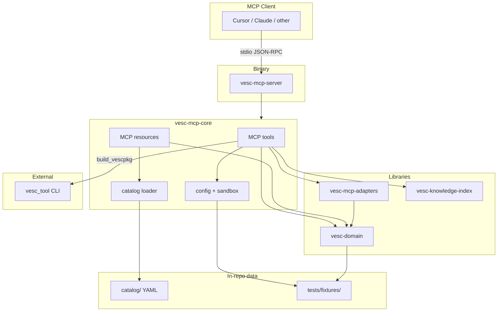
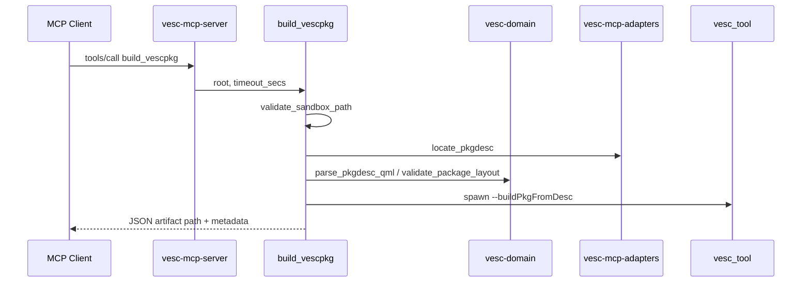

# Architecture

vesc-mcp is a **stdio MCP server** that wraps VESC firmware and vescpkg domain logic for AI assistants. The host process never loads device FFI; builds and inspections run on the developer machine under configurable path sandboxes.

## Crate graph

## Layer responsibilities

| Layer | Crate / path | Responsibility |
|-------|----------------|----------------|
| Transport | `vesc-mcp-server` | stdio MCP session, tracing to stderr |
| MCP surface | `vesc-mcp-core` | Tool router, resource registry, config, workspace discovery |
| Domain | `vesc-domain` | `pkgdesc.qml` parsing, `.vescpkg` wire read/parse, validation types |
| Build adapter | `vesc-mcp-adapters` | Locate `pkgdesc.qml` and inspect `.vescpkg` wire artifacts |
| Knowledge | `vesc-knowledge-index` | Embedded search index over catalog-derived entries |
| Catalog | `catalog/` | YAML indexes (build flows, commands, ABI, doc topics) — no GPL source vendored |
| Fixtures | `tests/fixtures/` | Synthetic offline package trees for CI |

## Tool flow (example)

## Resource flow

Static resources are registered at startup from `catalog/` and fixture metadata. Dynamic reads use URI templates:

- `vescpkg://manifest/{path}` — parse live pkgdesc under sandbox roots
- `vesc://catalog/commands/refloat/{command}` — render markdown from indexed command docs

Build-recipe and doc-topic bodies include **source attribution** footers pointing at resolved repo paths (`VESC_*_ROOT`).

## Boundaries and non-goals

| In scope | Out of scope |
|----------|--------------|
| Package discovery, inspect, validate, build | Rider-facing tuning docs |
| Catalog-backed docs and ABI summaries | Duplicating full POC or refloat internals |
| Sandboxed path access | Default-on flash/upload |
| `vesc_tool` subprocess builds | Loading `vesc-ffi` / BLE protocol in MCP host |
| Read-only wire parsing in `vesc-domain` | In-repo `.vescpkg` packers |

## Testing architecture

| Tier | Location |
|------|----------|
| Unit | `#[cfg(test)]` in crate sources |
| Integration | `crates/*/tests/*.rs` |
| MCP harness | `McpTestHarness` in `vesc-mcp-core::test_support` |

See [testing.md](testing.md).
