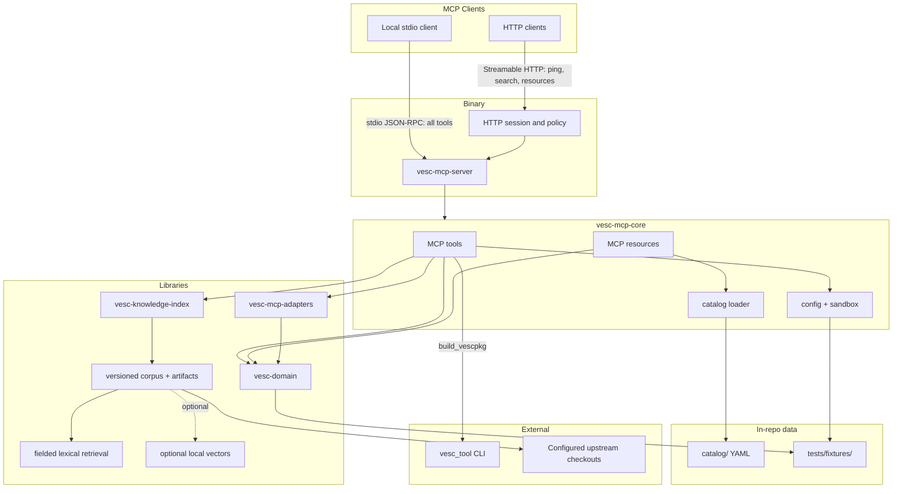
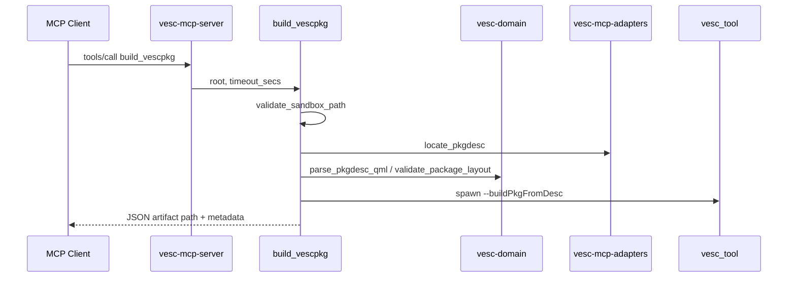
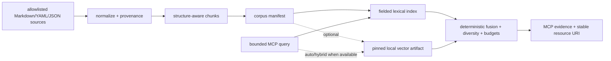

# Architecture reference

vesc-mcp is an MCP server for VESC firmware and vescpkg domain knowledge. The
binary serves one stdio client by default or a shared Streamable HTTP endpoint
with `--http`. The host process never loads device FFI; package builds and
inspection remain local, sandboxed stdio operations.

## Crate graph

## Layer responsibilities

| Layer | Crate / path | Responsibility |
|-------|----------------|----------------|
| Transport | `vesc-mcp-server` | Default stdio session; optional shared Streamable HTTP sessions, Host/Origin policy, and bearer authentication |
| MCP surface | `vesc-mcp-core` | Tool router, resource registry, config, workspace discovery |
| Domain | `vesc-domain` | `pkgdesc.qml` parsing, `.vescpkg` wire read/parse, validation types |
| Build adapter | `vesc-mcp-adapters` | Locate `pkgdesc.qml` and inspect `.vescpkg` wire artifacts |
| Knowledge | `vesc-knowledge-index` | Versioned normalized corpus, deterministic chunking, fielded lexical retrieval, optional local vectors, fusion, and artifact lifecycle |
| Catalog | `catalog/` | Reviewed YAML indexes for build flows, commands, ABI, and doc topics |
| Upstream sources | `vendor/` or configured roots | Optional local reference checkouts used for validation, attribution, and knowledge builds |
| Fixtures | `tests/fixtures/` | Synthetic offline package trees for CI |

## Tool flow (example)

## Resource flow

Static resources are registered at startup from `catalog/` and fixture metadata. Dynamic reads use URI templates:

- `vescpkg://manifest/{path}` — parse live pkgdesc under sandbox roots
- `vesc://catalog/commands/refloat/{command}` — render markdown from indexed command docs
- `vesc://knowledge/chunk/{id}` — read the bounded normalized passage returned by retrieval
- `vesc://knowledge/document/{id}` — read the complete normalized document assembled from its chunks

Both transports expose the resource registry, including subscriptions. Each
Streamable HTTP MCP session has an isolated current-repository selection, so
many chats can share one server without leaking repository context. HTTP
package-tree tools still require authentication and sandboxed roots.

## Retrieval flow

`lexical` is the offline default after passing the locked evaluation gate.
`legacy` remains the explicit compatibility mode. The lexical path uses the
normalized in-memory Tantivy index. Hybrid fusion uses RRF with a lexical floor
and bounded adjacent context, so an uncalibrated semantic model cannot displace
trusted lexical evidence; `auto` reports an error when semantic capability is
unavailable. Artifact writes are staged and the active manifest
selector is replaced only after checksum validation. The selector in
`active.json` points to the full generation manifest and carries its checksum;
readers should use the lifecycle inspection API, which also accepts legacy
full-manifest `active.json` files.

The lexical MCP path caches the validated index by immutable generation path,
so a rebuilt generation naturally invalidates the cache. Search responses expose
bounded index diagnostics (corpus digest, counts, source count, component
versions, and diagnostic count) without raw queries or private filesystem paths.

Build-recipe and doc-topic bodies include repository-relative source
attribution. Search responses and resources do not expose private filesystem
paths.

## Boundaries and non-goals

| In scope | Out of scope |
|----------|--------------|
| Package discovery, inspect, validate, build | Rider-facing tuning docs |
| Catalog-backed docs and ABI summaries | Duplicating full POC or refloat internals |
| Sandboxed path access | Default-on flash/upload |
| `vesc_tool` subprocess builds | Loading `vesc-ffi` / BLE protocol in MCP host |
| Read-only wire parsing in `vesc-domain` | In-repo `.vescpkg` packers |
| Shared HTTP knowledge search/resources | Unauthenticated HTTP package access |

## Running the service

The release server runs as one local stdio process or as a shared Streamable
HTTP process. See [installation.md](installation.md) and [http.md](http.md) for
user setup.

## Testing architecture

| Tier | Location |
|------|----------|
| Unit | `#[cfg(test)]` in crate sources |
| Integration | `crates/*/tests/*.rs` |
| MCP harness | `McpTestHarness` in `vesc-mcp-core::test_support` |

See [testing.md](testing.md).
