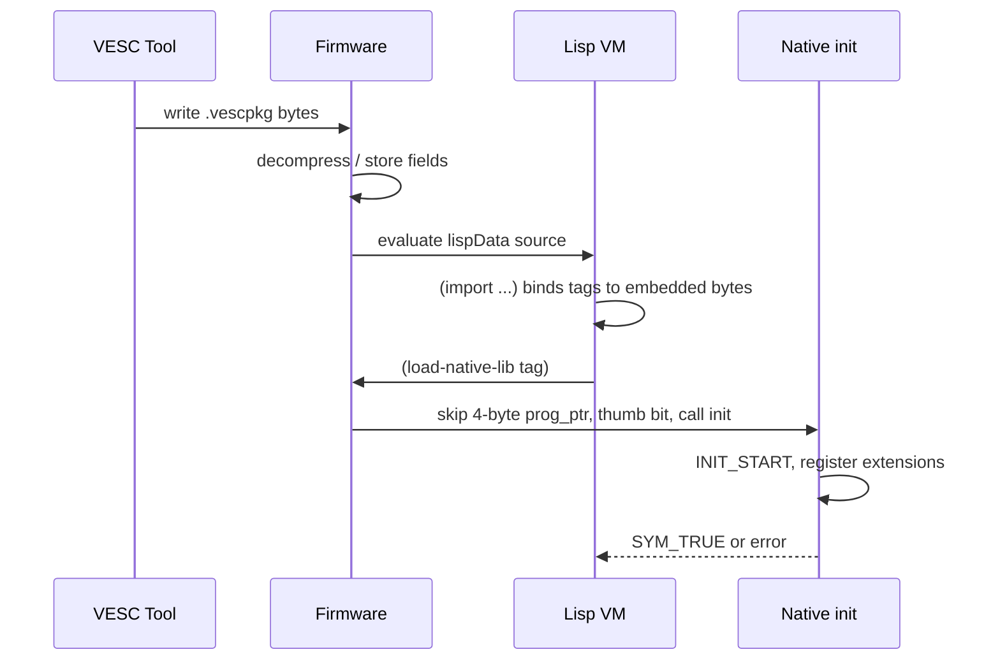

# vesc_pkg_lib native ABI

Native library contract for VESC custom packages: why packages ship `.bin` payloads, loader macros, init sequence, refloat C vs POC Rust paths, and firmware `(load-native-lib …)` behavior.

## Purpose

VESC packages combine:

1. **Lisp loader** — orchestration, firmware API calls, UI hooks
2. **Optional native binary** — performance-critical or low-level access

Lisp alone is insufficient for many workloads. The firmware loads native code into a restricted memory model; the package must export a **loader contract** (program pointer section + init function) discoverable by `ext_load_native_lib`.

## Firmware interface table

Source of truth: `$VESC_ROOT/lispBM/c_libs/vesc_c_if.h` (refloat vendored copy: `$VESC_REFLOAT_ROOT/vesc_pkg_lib/vesc_c_if.h`).

Catalog: `catalog/vesc/native-lib-macros.yaml`, MCP resource `vesc://catalog/doc/topic/vesc_c_if`.

### Core macros and types

| Symbol | Role |
|--------|------|
| `VESC_IF` | Fixed-address table at `0x1000F800` — `((vesc_c_if*)(0x1000F800))` |
| `lib_info` | Struct passed to init: `stop_fun`, `arg`, `base_addr` |
| `HEADER` | `.program_ptr` section word at start of native lib |
| `INIT_FUN` | `bool init(lib_info *info)` in `.init_fun` section |
| `INIT_START` | `(void)prog_ptr` — first statement in init |
| `PROG_ADDR` | `((uint32_t)&prog_ptr)` |
| `ARG` | `(*VESC_IF->get_arg(PROG_ADDR))` |

Link requirements (`vesc_pkg_lib/rules.mk`):

- `-nostartfiles -static -T link.ld`
- `--undefined=init` — retain init section
- `-DIS_VESC_LIB`, Cortex-M4 hard float

### Init sequence (pseudocode)

```c
HEADER;  /* volatile int prog_ptr in .program_ptr */

INIT_FUN init(lib_info *info) {
    INIT_START;
    info->arg = ARG;
    info->stop_fun = my_stop_callback;
    /* register Lisp extensions */
    VESC_IF->lbm_add_extension("my-ext", my_ext_fun);
    return true;  /* false → "Library init failed" at runtime */
}
```

On unload, firmware invokes `info->stop_fun`.

## Loader review invariants: check exact lifetimes before applying general rules

These invariants exist to prevent plausible embedded-Rust or ownership rules
from overriding the actual VESC loader contract. They are retrieval guidance,
not instructions to copy one project's policy into every package.

### `arg` and `base_addr` can outlive `stop_fun`

Do not infer that stopping a native library makes every pointer reachable from
its package argument unreachable. In the VESC loader implementation,
`lib_get_arg` locates the loaded-library entry by `base_addr` and returns the
stored `arg`. Stopping the library clears `stop_fun`; it does not establish that
`arg` or `base_addr` has been cleared, nor does LispBM extension registration
provide a matching unregister/quiescence guarantee.

Consequently, an SDK that admits late stateful LispBM callbacks may need two
different lifetimes:

- package state `T`, which can be dropped during stop; and
- a small runtime admission header/backlink, which remains as a `STOPPED`
  tombstone so a late callback can reject access without touching `T`.

Freeing that header merely because package state has stopped can turn the first
late-callback phase check into a use-after-free. Before calling retained memory
a leak, inspect the exact `get_arg` path, callback-unregistration guarantee,
regression tests naming late callbacks or tombstones, and the commit that
introduced the lifetime split. Thread/custom-data examples are only comparable
when they quiesce or unregister every accessor before freeing state.

### `false` from init is a loader failure, not a warning

The native init callback's boolean is the VESC loader success contract: `false`
produces `Library init failed`. A package whose registrations are intentionally
optional may therefore need best-effort initialization: attempt each optional
hook/registration, preserve diagnostics, and return `true` so VESC can continue
loading/probing the package. Do not convert optional setup into short-circuiting
required setup without checking the package's accepted policy and
hardware-known-good history.

This does not mean every package must ignore every initialization error. It
means three questions must remain separate: whether a branch introduced the
behavior, what VESC does with the boolean, and what the package's accepted
hardware contract requires.

### Panic ownership is a project contract

The general Rust convention that a final binary owns `#[panic_handler]` does
not by itself prove an SDK-owned handler is a bug. Some VESC package SDKs
deliberately own one minimal, non-returning ARM panic policy because packages
have no unwind/recovery boundary and customization is out of scope. Before
moving or duplicating a handler, search the project's accepted decisions and
the introducing commit. Classify this as project-scoped policy, not a universal
VESC ABI requirement.

For loader and runtime reviews, use authorities in this order:

1. accepted project decisions and hardware-known-good invariants;
2. exact VESC implementation and ABI behavior;
3. regression tests and introducing commit history;
4. branch provenance against `main`;
5. general Rust conventions and analogous examples.

For each proposed finding, identify the introducing commit, read tests that name
the behavior, search accepted decisions, verify the exact VESC contract, and
classify it as branch-introduced, pre-existing, or intentional before editing
code.

## refloat C path

Catalog: `catalog/refloat/native-lib.yaml`, `catalog/refloat/build-flow.yaml`.

### Build pipeline

```
src/*.c  →  arm-none-eabi-gcc  →  package_lib.elf
         →  objcopy            →  package_lib.bin
         →  (optional conv.py) →  package_lib.lisp hex array
```

| Step | Location | Notes |
|------|----------|-------|
| Native Makefile | `$VESC_REFLOAT_ROOT/src/Makefile` | `TARGET=package_lib`, includes `vesc_pkg_lib/rules.mk` |
| Link script | `vesc_pkg_lib/link.ld` | `.program_ptr` and `.init_fun` at MEM start |
| Output | `src/package_lib.bin` | Consumed by Lisp import, not conv.py in default refloat flow |

### Loader Lisp

Production refloat (`lisp/package.lisp` pattern):

```lisp
(import "src/package_lib.bin" 'package-lib)
(load-native-lib package-lib)
```

refloat may add firmware-version gating and conditional `(import "bms.lisp" 'bms)` — package-specific.

### conv.py alternate path

`vesc_pkg_lib/conv.py` generates a `(def name [0x..])` byte array embedding — alternate to direct `.bin` import. Default refloat Makefile uses `.bin` import; conv.py is documented for standalone experiments.

## POC Rust path

Catalog: `catalog/abi/minimal-test-package-abi.yaml`, MCP resource `vesc://catalog/abi/minimal-test-package`.

POC packages use `thumbv7em-none-eabihf` Rust staticlib + C shim. Same conceptual import/embed path; different toolchain and symbol audit gate.

### Minimal 12-symbol surface

| Requirement | Kind | Caller / callee |
|-------------|------|-----------------|
| `prog_ptr` | loader_header | Rust export — program pointer word |
| `init` | entry_point | Firmware calls Rust-owned init trampoline |
| `lib_info` | type | Init receives package metadata |
| `lbm_add_extension` | function | Rust registers LispBM extensions via `VESC_IF` |
| `lbm_value`, `lbm_uint` | types | Extension ABI |
| `lbm_dec_as_i32` | function | Decode LispBM integer args |
| `lbm_enc_i` | function | Encode integer results |
| `VESC_IF.lbm_enc_sym_eerror` | error_symbol | Bad-arg eval error symbol |
| `VESC_IF.set_app_data_handler` | function | BLE loopback callback registration |
| `VESC_IF.send_app_data` | function | BLE loopback replies |
| `VESC_IF.system_time_ticks` | function | Tick timestamp for loopback status |

Missing symbols fail POC `symbol_audit` at build time — expand ABI only when features require it.

Fixture loader (`tests/fixtures/native-lib-minimal/package/code.lisp`):

```lisp
(import "src/package_lib.bin" 'package-lib)
(load-native-lib package-lib)
```

`inspect_vescpkg` currently reports the first import tag in its
`lisp_editor_path` compatibility field; for this fixture the value is
`package-lib`.

## Firmware load path

Chain from VESC Tool upload to running extensions:



### vesc implementation anchors

| Step | Path | Code anchor | Content |
|------|------|-------------|---------|
| Register extension | `$VESC_ROOT/lispBM/lispif_vesc_extensions.c` | `load-native-lib`, `unload-native-lib` | Lisp entry-point registration |
| Entry | `$VESC_ROOT/lispBM/lispif_c_lib.c` | `ext_load_native_lib` | One byte-array argument |
| CIF table | `$VESC_ROOT/lispBM/lispif_c_lib.c` | `cif.cif` | First load fills the interface table |
| Load sequence | `$VESC_ROOT/lispBM/lispif_c_lib.c` | `array->data`, `addr += 4`, `addr \|= 1` | Skip program pointer, set Thumb bit, call init |
| Result | `$VESC_ROOT/lispBM/lispif_c_lib.c` | `SYM_TRUE`, `Library init failed` | Success/error contract |
| Unload | `$VESC_ROOT/lispBM/lispif_c_lib.c` | `stop_fun` | Cleanup callback |

**Thumb rule:** firmware sets bit 0 on init address before calling.

Embedded `.bin` in `lispData` → Lisp byte array → skip first 4 bytes (program pointer) → call `INIT_FUN`.

## ABI surface area guidance

| Profile | Symbols | When |
|---------|---------|------|
| **Minimal POC** | 12 in `minimal-test-package-abi.yaml` | Proof packages, MCP fixtures |
| **Feature package** | Subset of `catalog/vesc/vesc_c_if.yaml` groups | NVM, CAN, comm handlers as needed |
| **Full firmware API** | 20+ groups in `vesc_c_if.h` | Production refloat-scale packages |

Guidelines:

- Null-check `VESC_IF` entries when targeting firmware &lt; 6.05 (append-only versioning in header).
- Rust `no_std` packages cannot assume full C runtime — keep shims thin.
- refloat command protocol (`COMM_CUSTOM_APP_DATA`, interface id 101) is **separate** from loader ABI — see refloat command MCP resources.

## Comparison matrix

| Aspect | refloat C | POC Rust | vesc_tool-only (no native) |
|--------|-----------|----------|----------------------------|
| Toolchain | arm-none-eabi-gcc | `thumbv7em-none-eabihf` + C shim | n/a |
| Native output | `package_lib.bin` | `package_lib.bin` via staticlib | — |
| Lisp loader | hand-written imports | same pattern | `(load-native-lib …)` omitted |
| Build | `make -C src && make` | `make package` | `vesc_tool --buildPkgFromDesc` |
| ABI reference | vendored `vesc_c_if.h` | `catalog/abi/minimal-test-package-abi.yaml` | — |

## Related documents

- Wire embed geometry: [vescpkg-wire-format.md](vescpkg-wire-format.md)
- Master index: [vescpackage-reference.md](vescpackage-reference.md)
- Gap analysis: [catalog/gap-analysis.md](../catalog/gap-analysis.md)
