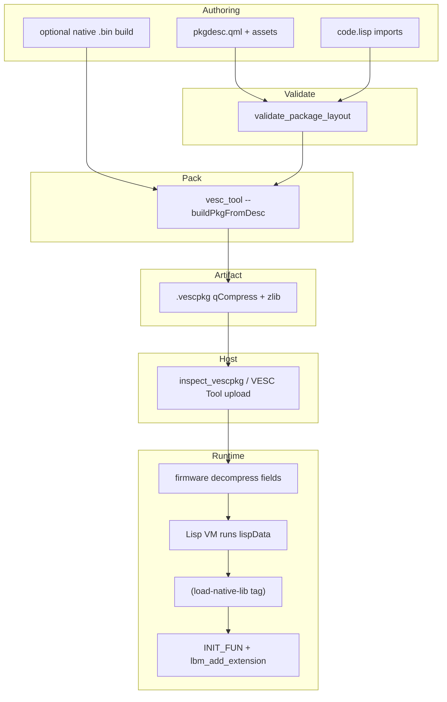

# VESC package reference

Reference for creating and diagnosing VESC custom packages, from
`pkgdesc.qml` through a built `.vescpkg`, the on-device Lisp loader, and the
optional native-library ABI.

## Document map

| Document | Scope |
|----------|-------|
| [vescpkg-wire-format.md](vescpkg-wire-format.md) | Byte-level `.vescpkg` spec, `lispData` geometry, failure taxonomy, [golden hex appendix](vescpkg-wire-format.md#appendix--annotated-golden-hex-walkthrough) |
| [vesc-pkg-lib-abi.md](vesc-pkg-lib-abi.md) | Native loader contract, macros, C vs Rust paths, firmware load sequence |
| [configuration.md](configuration.md) | Env vars (`VESC_REFLOAT_ROOT`, `VESC_BLDC_ROOT`, `VESC_TOOL_PATH`, …) |
| [safety.md](safety.md) | Flash/upload gates (default off) |

Related MCP resources: `vesc://catalog/doc/topic/vescpackage_reference`, `vesc://catalog/doc/topic/pkgdesc_dialects`, `vesc://catalog/doc/topic/lisp_imports`, `vesc://catalog/doc/topic/vesc_c_if`.

## End-to-end lifecycle



### Pipeline steps

1. **Authoring** — Create `pkgdesc.qml`, loader `.lisp`, optional UI `.qml`, README markdown, and optional native sources under a package root.
2. **Validation** — `validate_package_layout` checks that descriptor-relative paths (`pkgDescriptionMd`, `pkgLisp`, `pkgQml`) resolve to existing files under the root.
3. **Packing** — `vesc_tool --buildPkgFromDesc pkgdesc.qml` (refloat Makefile default). This is the authoritative path documented by VESC Tool / `codeloader.cpp`.
4. **Artifact** — On-disk `.vescpkg`: Qt `qCompress` wrapper (4-byte BE length + zlib) around a `"VESC Packet"` field spine.
5. **Distribution** — VESC Tool upload to ESC, or offline inspection via MCP `inspect_vescpkg`.
6. **Runtime** — Firmware stores fields, evaluates `lispData` Lisp source, resolves `(import …)` embedded binaries, calls `(load-native-lib …)`.
7. **Extensions** — Native `init` registers symbols via `VESC_IF->lbm_add_extension`; app-level protocols (e.g. refloat commands) are a separate layer.

## Sharp edges (read first)

| Edge | Detail |
|------|--------|
| `lisp_editor_path` | In `vesc_tool`, import paths resolve relative to the lisp file directory (`codeloader.cpp`). Fixture trees document expected layout under `tests/fixtures/`. |
| Legacy POC pkgdesc | Keys like `packageName`, `nativeLibraryPath` are **invalid**. `vesc-domain` returns `DomainError::LegacyPocDialect`. Use vesc_tool schema only (`pkgName`, `pkgLisp`, …). |
| Empty wire fields | May be **omitted** from the spine, not written as zero-length placeholders. Golden fixture omits empty `qmlFile`. |
| `pkgOutput` | Names the output **file on disk during build** only — not a wire field. |
| Wire read | `vesc-domain::wire` implements the reader only; packing is always `vesc_tool`. |

## On-disk layout and pkgdesc

### vesc_tool QML schema (canonical)

| QML property | Wire field | Notes |
|--------------|------------|-------|
| `pkgName` | `name` | Required; sanitized for artifact naming |
| `pkgDescriptionMd` | `description_md` | Relative path → markdown file (not inline) |
| `pkgLisp` | (inside `lispData`) | Relative path → loader Lisp |
| `pkgQml` | `qmlFile` | Relative path → UI QML; may be empty string |
| `pkgQmlIsFullscreen` | `qmlIsFullscreen` | Single-byte bool in wire |
| `pkgOutput` | — | Output filename only, e.g. `refloat.vescpkg` |

Optional refloat-only: `isCompatible(fwRxParams)` JavaScript guard — evaluated by vesc_tool; preserved in wire `pkgDescQml`; **not** parsed by `vesc-domain`.

### Fixture directory trees

**refloat-minimal** (`tests/fixtures/refloat-minimal/`):

```
refloat-minimal/
  pkgdesc.qml
  package_README-gen.md
  lisp/
    package.lisp
  ui.qml
```

**native-lib-minimal** (`tests/fixtures/native-lib-minimal/`):

```
native-lib-minimal/
  package/
    pkgdesc.qml
    code.lisp
    README.md
  src/
    package_lib.bin    ← embedded via lispData import table
```

`locate_pkgdesc` searches `pkgdesc.qml` and `package/pkgdesc.qml` under a sandbox root.

### Layout validation

`validate_package_layout(root, desc)` mirrors `LayoutIssue::MissingAsset`:

- Missing readme (`pkgDescriptionMd` path)
- Missing lisp (`pkgLisp` path)
- Missing QML when `pkgQml` is non-empty

Negative fixtures: `tests/fixtures/broken-missing-lisp/`.

## Build recipes (summary)

Full Makefile detail lives in `catalog/refloat/build-flow.yaml` and MCP resource `vesc://catalog/build-recipe/refloat-vesc-tool`.

| Mode | Command | When |
|------|---------|------|
| Modern pkgdesc | `vesc_tool --buildPkgFromDesc pkgdesc.qml` | Default (`OLDVT=0`) |
| Legacy colon | `vesc_tool --buildPkg "out:lisp:qml:fs:readme:name"` | `OLDVT=1` on old vesc_tool |
| Native dep | `make -C src` | Before pack; produces `package_lib.bin` |

Makefile variables: `VESC_TOOL`, `MINIFY_QML`, `OLDVT` — see build-flow catalog.

## Packer reference (authoritative)

| Aspect | vesc_tool (`codeloader.cpp`) |
|--------|------------------------------|
| Entry | `--buildPkgFromDesc pkgdesc.qml` |
| Descriptor | Reads QML properties live |
| Native embed | `lispPackImports(…, editorPath, …)` |
| Compression | Qt `qCompress` (4-byte BE length + zlib) |
| Legacy | `--buildPkg` colon format when `OLDVT=1` |

In-repo reader: `crates/vesc-domain/src/wire/mod.rs`.

## Ground truth and test anchors

| Anchor | Use |
|--------|-----|
| `tests/fixtures/golden/native-lib-minimal.vescpkg` + `.sha256` | Read-only wire reference (see `tests/fixtures/golden/README.md`) |
| `vesc-domain` wire tests | Parser behavior, import geometry |
| `tests/fixtures/broken-*` | Wire error taxonomy |
| `catalog/*.yaml` | Structured citations with env vars |

## Use through MCP

Use this reference alongside live MCP tools (offline fixtures first):

| Tool | Use |
|------|-----|
| `inspect_pkgdesc` | Parse `pkgdesc.qml` under sandbox roots |
| `inspect_vescpkg` | Decode wire fields and lisp imports from `.vescpkg` |
| `validate_package_layout` | Pre-build asset checks |
| `build_vescpkg` | Spawn `vesc_tool --buildPkgFromDesc` (requires `VESC_TOOL_PATH`) |

| Resource URI | Topic |
|--------------|-------|
| `vescpkg://fixture/refloat-minimal/manifest` | Parsed refloat fixture |
| `vescpkg://fixture/native-lib-minimal/manifest` | Parsed native-lib fixture |
| `vesc://catalog/build-recipe/refloat-vesc-tool` | Refloat Makefile + vesc_tool |
| `vesc://catalog/abi/minimal-test-package` | 12-symbol POC ABI JSON |

Env vars: see [configuration.md](configuration.md). No device upload or flash
tools currently ship; see [safety.md](safety.md).

## Source walkthroughs

Each table uses paths and code anchors instead of line numbers so it remains
valid across upstream revisions. Roots resolve through `$VESC_REFLOAT_ROOT`,
`$VESC_BLDC_ROOT`, `$VESC_VESC_TOOL_ROOT`, and `$VESC_POC_ROOT`; see
[configuration.md](configuration.md).

### Example A — Refloat production package (authoring → artifact)

| Step | Path | Code anchor | What it proves | Next |
|------|------|-------------|----------------|------|
| 1. Descriptor | `$VESC_REFLOAT_ROOT/pkgdesc.qml` | `pkgName`, `isCompatible` | Canonical vesc_tool QML fields and compatibility guard | → Makefile pack target |
| 2. Build entry | `$VESC_REFLOAT_ROOT/Makefile` | `--buildPkgFromDesc`, `OLDVT` | Current descriptor build and legacy colon build | → native dep |
| 3. Native dep | `$VESC_REFLOAT_ROOT/Makefile` | `make -C src` | Native binary is built before packaging | → Lisp loader |
| 4. Lisp loader | `$VESC_REFLOAT_ROOT/lisp/package.lisp` | `load-native-lib` | Imported native bytes are loaded by Lisp | → firmware runtime (Example C) |
| 5. BMS conditional | `$VESC_REFLOAT_ROOT/lisp/package.lisp` | `bms.lisp` | Firmware-gated Refloat BMS import | — |
| 6. Header | `$VESC_REFLOAT_ROOT/src/main.c` | `HEADER` | `.program_ptr` section word | → init |
| 7. Init | `$VESC_REFLOAT_ROOT/src/main.c` | `INIT_FUN`, `INIT_START` | Library argument and stop callback setup | → extensions |
| 8. Extensions | `$VESC_REFLOAT_ROOT/src/main.c` | `lbm_add_extension` | Lisp extensions are registered after native load | → Example C step 4 |
| 9. Native build | `$VESC_REFLOAT_ROOT/src/Makefile` | `TARGET`, `VESC_C_LIB_PATH` | Refloat includes the shared native-library rules | → bin output |
| 10. Output | `$VESC_REFLOAT_ROOT/vesc_pkg_lib/rules.mk` | `objcopy` | `package_lib.bin` is produced for the Lisp import | → wire packer (Example D) |

### Example B — vesc_pkg_lib toolchain

| Step | Path | Code anchor | What it proves | Next |
|------|------|-------------|----------------|------|
| 1. Header (Refloat) | `$VESC_REFLOAT_ROOT/vesc_pkg_lib/vesc_c_if.h` | `lib_info`, `HEADER`, `INIT_FUN` | Native library entry contract | → link script |
| 2. Header (bldc canonical) | `$VESC_BLDC_ROOT/lispBM/c_libs/vesc_c_if.h` | same macros | Firmware source of truth | → compile |
| 3. Link script | `$VESC_REFLOAT_ROOT/vesc_pkg_lib/link.ld` | `.program_ptr`, `.init_fun` | Entry sections are placed at memory start | → flags |
| 4. Compile flags | `$VESC_REFLOAT_ROOT/vesc_pkg_lib/rules.mk` | `IS_VESC_LIB`, `--undefined=init` | Cortex-M native-library build settings | → bin output |
| 5. Binary output | `$VESC_REFLOAT_ROOT/vesc_pkg_lib/rules.mk` | `objcopy`, `conv.py` | Binary and optional Lisp representations | → import or conversion path |
| 6. Converter | `$VESC_REFLOAT_ROOT/vesc_pkg_lib/conv.py` | Lisp `def` emission | Alternate byte-array embedding | Contrast: Refloat defaults to `.bin` import |

### Example C — bldc firmware runtime (`load-native-lib`)

| Step | Path | Code anchor | What it proves | Next |
|------|------|-------------|----------------|------|
| 1. Register extension | `$VESC_BLDC_ROOT/lispBM/lispif_vesc_extensions.c` | `load-native-lib`, `unload-native-lib` | Lisp entry points are registered | → entry |
| 2. Entry | `$VESC_BLDC_ROOT/lispBM/lispif_c_lib.c` | `ext_load_native_lib` | One byte-array argument enters the loader | → CIF table |
| 3. CIF table | `$VESC_BLDC_ROOT/lispBM/lispif_c_lib.c` | `cif.cif` | First load fills the firmware interface table | → load sequence |
| 4. Load sequence | `$VESC_BLDC_ROOT/lispBM/lispif_c_lib.c` | `array->data`, `addr += 4`, `addr \|= 1` | Skip program pointer, set Thumb bit, call init | → result |
| 5. Result | `$VESC_BLDC_ROOT/lispBM/lispif_c_lib.c` | `SYM_TRUE`, `Library init failed` | Loader success/error contract | → unload |
| 6. Unload | `$VESC_BLDC_ROOT/lispBM/lispif_c_lib.c` | `stop_fun` | Library cleanup callback | — |
| 7. Package import docs | `$VESC_BLDC_ROOT/lispBM/README.md` | `pkg@path.vescpkg` | Package import syntax | — |

**Swimlane:** `lispData` embedded `.bin` → Lisp byte array → skip 4-byte `prog_ptr` → `INIT_FUN` (cross-link Example A step 7).

### Example D — vesc_tool wire writer (packer; not in bldc)

| Step | Path | Code anchor | What it proves | Next |
|------|------|-------------|----------------|------|
| 1. Descriptor | `$VESC_VESC_TOOL_ROOT/codeloader.cpp` | `pkgName`, `pkgLisp`, `pkgOutput` | Canonical QML properties | → Lisp pack |
| 2. Lisp pack call | `$VESC_VESC_TOOL_ROOT/codeloader.cpp` | `lispPackImports`, `canonicalPath` | Imports resolve relative to the Lisp file | → algorithm |
| 3. Import packing | `$VESC_VESC_TOOL_ROOT/codeloader.cpp` | `lispPackImports` | Header, imports, offsets, and payload packing | → spine |
| 4. Package packing | `$VESC_VESC_TOOL_ROOT/codeloader.cpp` | `packVescPackage`, `qCompress` | Magic, wire fields, and compression | → unpack |
| 5. Unpack | `$VESC_VESC_TOOL_ROOT/codeloader.cpp` | package unpack routine | Parser mirror for `vesc-domain` parity | → in-repo reader |

In-repo reader: `crates/vesc-domain/src/wire/mod.rs` (`FIELD_SPINE`, `package_fields`, `parse_lisp_imports`).

### Example E — In-repo fixtures (offline)

| Fixture | Path | Maps to | MCP / test anchor |
|---------|------|---------|-------------------|
| refloat-minimal | `tests/fixtures/refloat-minimal/pkgdesc.qml` | Example A descriptor | `inspect_pkgdesc`, `vescpkg://fixture/refloat-minimal/manifest` |
| native-lib-minimal | `tests/fixtures/native-lib-minimal/package/` | nested layout + native embed | `build_vescpkg` (needs `vesc_tool`) |
| golden | `tests/fixtures/golden/native-lib-minimal.vescpkg` | annotated hex — [wire appendix](vescpkg-wire-format.md#appendix--annotated-golden-hex-walkthrough) | `inspect_vescpkg` (read-only) |
| domain | `crates/vesc-domain/src/wire/mod.rs` | reader impl | wire unit tests |

### Example F — Wire golden (read-only)

| Path | What it proves |
|------|----------------|
| `$VESC_VESC_TOOL_ROOT/codeloader.cpp` | Authoritative pack/unpack |
| `tests/fixtures/golden/native-lib-minimal.vescpkg` | Committed wire reference bytes |

## Further reading

- Wire bytes: [vescpkg-wire-format.md](vescpkg-wire-format.md)
- Native ABI: [vesc-pkg-lib-abi.md](vesc-pkg-lib-abi.md)
- Gap matrix: [catalog/gap-analysis.md](../catalog/gap-analysis.md)
- Example sessions: [docs/examples/](examples/)
