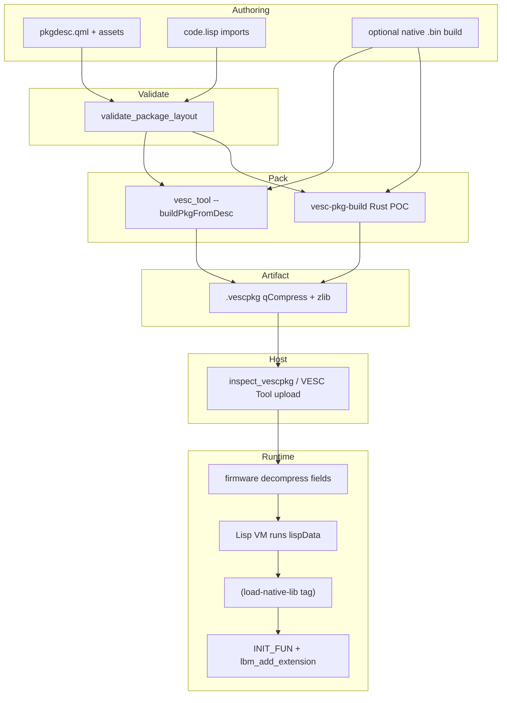

# VESC package reference

Textbook-depth reference for VESC custom packages: from `pkgdesc.qml` on disk through packer, `.vescpkg` wire bytes, VESC Tool upload, on-device Lisp loader, and native library ABI. Target audience: AI assistants and package/firmware developers who must implement or debug packages without spelunking four repos.

## Document map

| Document | Scope |
|----------|-------|
| [vescpkg-wire-format.md](vescpkg-wire-format.md) | Byte-level `.vescpkg` spec, `lispData` geometry, failure taxonomy |
| [vesc-pkg-lib-abi.md](vesc-pkg-lib-abi.md) | Native loader contract, macros, C vs Rust paths, firmware load sequence |
| [poc-integration.md](poc-integration.md) | vesc-mcp ↔ vesc-rust-poc adapter boundaries and sharp edges |
| [configuration.md](configuration.md) | Env vars (`VESC_REFLOAT_ROOT`, `VESC_BLDC_ROOT`, `VESC_POC_ROOT`, …) |
| [safety.md](safety.md) | Flash/upload gates (default off) |

Related MCP resources: `vesc://catalog/doc/topic/vescpackage_reference`, `vesc://catalog/doc/topic/pkgdesc_dialects`, `vesc://catalog/doc/topic/lisp_imports`, `vesc://catalog/doc/topic/vesc_c_if`.

## End-to-end lifecycle



### Pipeline steps

1. **Authoring** — Developer edits `pkgdesc.qml`, loader `.lisp`, optional UI `.qml`, README markdown, and native sources under a package root.
2. **Validation** — `validate_package_layout` checks that descriptor-relative paths (`pkgDescriptionMd`, `pkgLisp`, `pkgQml`) resolve to existing files under the root.
3. **Packing** — **refloat** uses `vesc_tool --buildPkgFromDesc pkgdesc.qml`; **POC** uses `vesc-pkg-build::build_vesc_package`. Both emit the same wire dialect when configured correctly.
4. **Artifact** — On-disk `.vescpkg`: Qt `qCompress` wrapper (4-byte BE length + zlib) around a `"VESC Packet"` field spine.
5. **Distribution** — VESC Tool upload to ESC, or offline inspection via MCP `inspect_vescpkg`.
6. **Runtime** — Firmware stores fields, evaluates `lispData` Lisp source, resolves `(import …)` embedded binaries, calls `(load-native-lib …)`.
7. **Extensions** — Native `init` registers symbols via `VESC_IF->lbm_add_extension`; app-level protocols (e.g. refloat commands) are a separate layer.

## Sharp edges (read first)

| Edge | Detail |
|------|--------|
| `lisp_editor_path` | Package **root**, not the `.lisp` file path. Import paths in `(import "src/foo.bin" …)` resolve relative to this root. See `vesc-mcp-adapters` build path and POC `VescPackageInput::lisp_editor_path`. |
| Legacy POC pkgdesc | Keys like `packageName`, `nativeLibraryPath` are **invalid**. `vesc-domain` returns `DomainError::LegacyPocDialect`. Use vesc_tool schema only (`pkgName`, `pkgLisp`, …). |
| Empty wire fields | May be **omitted** from the spine, not written as zero-length placeholders. Golden fixture omits empty `qmlFile`. |
| `pkgOutput` | Names the output **file on disk during build** only — not a wire field. |
| Read vs write | Wire parsing lives in `vesc-domain`; packing calls `vesc-pkg-build`. Do not reimplement layout in adapters. |

## On-disk layout and pkgdesc

### vesc_tool QML schema (canonical)

| QML property | Wire field | Notes |
|--------------|------------|-------|
| `pkgName` | `name` | Required; sanitized for artifact naming |
| `pkgDescriptionMd` | `description_md` | Relative path → markdown file (not inline) |
| `pkgLisp` | (inside `lispData`) | Relative path → loader Lisp |
| `pkgQml` | `qmlFile` | Relative path → UI QML; may be empty string |
| `pkgQmlIsFullscreen` | `qmlIsFullscreen` | Single-byte bool in wire |
| `pkgOutput` | — | Output filename only, e.g. `refloat.vescpkg` |

Optional refloat-only: `isCompatible(fwRxParams)` JavaScript guard — evaluated by vesc_tool; preserved in wire `pkgDescQml`; **not** parsed by `vesc-domain`.

### Fixture directory trees

**refloat-minimal** (`tests/fixtures/refloat-minimal/`):

```
refloat-minimal/
  pkgdesc.qml
  README.md          ← referenced as package_README-gen.md in production refloat
  code.lisp          ← fixture uses simplified paths vs production lisp/package.lisp
  ui.qml
```

**poc-native-lib-minimal** (`tests/fixtures/poc-native-lib-minimal/`):

```
poc-native-lib-minimal/
  package/
    pkgdesc.qml
    code.lisp
    README.md
  src/
    package_lib.bin    ← embedded via lispData import table
```

`locate_pkgdesc` searches `pkgdesc.qml` and `package/pkgdesc.qml` under a sandbox root.

### Layout validation

`validate_package_layout(root, desc)` mirrors `LayoutIssue::MissingAsset`:

- Missing readme (`pkgDescriptionMd` path)
- Missing lisp (`pkgLisp` path)
- Missing QML when `pkgQml` is non-empty

Negative fixtures: `tests/fixtures/broken-missing-lisp/`.

## Build recipes (summary)

Full Makefile detail lives in `catalog/refloat/build-flow.yaml` and MCP resource `vesc://catalog/build-recipe/refloat-vesc-tool`.

| Mode | Command | When |
|------|---------|------|
| Modern pkgdesc | `vesc_tool --buildPkgFromDesc pkgdesc.qml` | Default (`OLDVT=0`) |
| Legacy colon | `vesc_tool --buildPkg "out:lisp:qml:fs:readme:name"` | `OLDVT=1` on old vesc_tool |
| Native dep | `make -C src` | Before pack; produces `package_lib.bin` |
| POC Rust | `make package` / `build_vescpkg` mode `rust` | vesc-pkg-build in sibling POC |

Makefile variables: `VESC_TOOL`, `MINIFY_QML`, `OLDVT` — see build-flow catalog.

## Packer comparison

| Aspect | vesc_tool | vesc-pkg-build (POC) |
|--------|-----------|----------------------|
| Entry | `--buildPkgFromDesc` | `build_vesc_package(&VescPackageInput)` |
| Descriptor | Reads QML properties live | Staged files + embedded pkgdesc text |
| Native embed | `lispPackImports` from disk | `pack_lisp_imports` — same offset algorithm |
| Legacy colon | `--buildPkg` | Not supported |
| Parity anchor | — | Golden SHA-256 `34e95e36…` on `poc-minimal.vescpkg` |

Upstream writers: `$VESC_TOOL_ROOT/codeloader.cpp` (pack/unpack); in-repo reader: `crates/vesc-domain/src/wire/mod.rs`.

## Ground truth and test anchors

| Anchor | Use |
|--------|-----|
| `tests/fixtures/golden/poc-minimal.vescpkg` + `.sha256` | Byte-identical pack output |
| `vesc-domain` wire tests | Parser behavior, import geometry |
| `vesc-mcp-adapters/tests/characterization.rs` | Packer parity, offset 100 example |
| `tests/fixtures/broken-*` | Wire error taxonomy |
| `catalog/*.yaml` | Structured citations with env vars |

Regenerate golden:

```bash
nix develop -c cargo run -p vesc-mcp-adapters --bin gen-poc-minimal-golden
```

## MCP / assistant integration

Use this reference alongside live MCP tools (offline fixtures first):

| Tool | Use |
|------|-----|
| `inspect_pkgdesc` | Parse `pkgdesc.qml` under sandbox roots |
| `inspect_vescpkg` | Decode wire fields and lisp imports from `.vescpkg` |
| `validate_package_layout` | Pre-build asset checks |
| `build_vescpkg` | `mode: "rust"` on fixtures; `vesc_tool` when binary available |

| Resource URI | Topic |
|--------------|-------|
| `vescpkg://fixture/refloat-minimal/manifest` | Parsed refloat fixture |
| `vescpkg://fixture/poc-native-lib-minimal/manifest` | Parsed POC fixture |
| `vesc://catalog/build-recipe/poc-rust-packer` | POC `make package` flow |
| `vesc://catalog/abi/minimal-test-package` | 12-symbol POC ABI JSON |

Env vars: see [configuration.md](configuration.md). Flash/upload tools remain gated — see [safety.md](safety.md).

## Further reading

- Wire bytes: [vescpkg-wire-format.md](vescpkg-wire-format.md)
- Native ABI: [vesc-pkg-lib-abi.md](vesc-pkg-lib-abi.md)
- Gap matrix: [catalog/gap-analysis.md](../catalog/gap-analysis.md)
- Example sessions: [docs/examples/](examples/)
